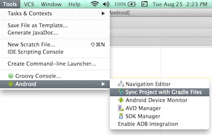

Importing the OpenX Mobile Android SDK
======================================

You can use
[Gradle](https://developer.android.com/tools/building/plugin-for-gradle.html)
and [Android
Studio](http://developer.android.com/tools/studio/index.html) to import
the OpenX Mobile Android SDK into your app.

1.  Extract the content from the SDK zip file.

    

2.  Open your project in your file explorer.
3.  Create a **libs** directory in your project if it does not already
    exist.

    

4.  Copy AndroidSDK-X.X.X.aar from the extracted
    OpenX\_Mobile\_SDK\_Android folder into **libs**.

    

5.  Change the project build.gradle file to include the **libs**
    directory.

    **build.gradle (Project: MyApp)**

        allprojects {
            repositories {
                ...
                flatDir {
                    dirs 'libs'
                }
            }
        }
                    

    

6.  Change the module build.gradle file (not the project build.gradle
    file) as follows:
    1.  Add `'com.google.android.gms:play-services-base:17.0.0'` and `'com.google.android.gms:play-services-ads-identifier:17.0.0'` (or current version) as a dependency.
    
    2. Add `implementation 'com.google.android.exoplayer:exoplayer-core:2.10.4'`, `implementation 'com.google.android.exoplayer:exoplayer-ui:2.10.4'` as a dependency.

    3.  Add the OpenX Mobile Android SDK .aar file as a dependency.

        **build.gradle (Module: app)**

            dependencies {
                ...
                implementation 'com.google.android.gms:play-services-base:17.0.0'
                implementation 'com.google.android.gms:play-services-ads-identifier:17.0.0'
                implementation 'com.google.android.exoplayer:exoplayer-core:2.10.4'
                implementation 'com.google.android.exoplayer:exoplayer-ui:2.10.4'
           
                implementation(name: 'AndroidSDK-x.x.x', ext:'aar')
            }
                        

        

7.  In Android Studio, select **Tools** \> **Android** \> **Sync Project
    with Gradle files**.

    

    The OpenX Mobile Android SDK library is now successfully added to
    your project.

8.  Select **Build** \> **Rebuild project**. Android Studio uses the
    Gradle build system, which refers to the build.gradle files in each
    of the projects you imported.
    
9.  Select **Run** \> **app** to launch your app integrated with OpenX
    Mobile Android SDK on a connected device or on an emulator.

You are now ready to [integrate the SDK with your
project](android-sdk-integration.md).

### See also 

-   [Launching the demo app](android-sdk-demo-app-launch.md)
