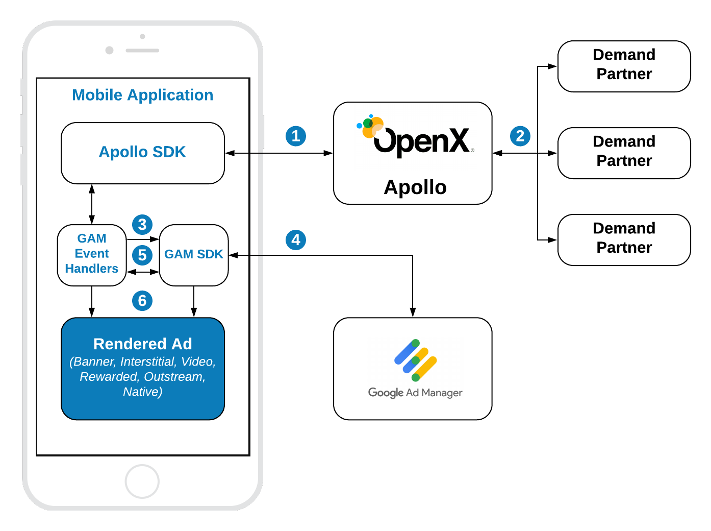

# Google Ad Manager Integration

The integration of Apollo SDK with Google Ad Manager (GAM) assumes that publisher has an account on GAM and has already integrated the GAM SDK into the app project. Apollo SDK was tested with **GAM SDK 7.61.0**. If you have any trouble with this or other versions, please, contact the [Apollo Support](https://www.openx.com/prebid/#form).

If you do not have GAM SDK in the app yet, refer the the [Google Integration Documentation](https://developers.google.com/ad-manager/mobile-ads-sdk/ios/quick-start).

## Order Setup 

To integrate header bidding with GAM you have to prepare a specific Order following the [instructions](ios-in-app-bidding-gam-order-setup.md) for particular ad kind.

### Rendering of vanilla prebid orders

If you want to run In-App Biding with Apollo using your Prebid orders on GAM you do not have to change anything on GAM. **Apollo SDK is able to work with prebid orders**. Just replace Prebid SDK with Apollo SDK and follow the current integration instructions. 

> Subsequently, we recommend to switch to Apollo orders in order to get better rendering, measurement and targeting.


## GAM Integration Overview



**Steps 1-2** Apollo SDK makes a bid request. Apollo server runs an auction and returns the winning bid to the SDK.

**Step 3** Apollo SDK via GAM Event Handler sets up targeting keywords into the GAM's ad unit.

**Step 4** GAM SDK makes an ad request. GAM returns the winner of the waterfall.

**Step 5** Basing on the ad response Apollo GAM Event Handler decided who won on the GAM - the Apollo bid or another ad source on GAM.

**Step 6** The winner is displayed in the App with the respective rendering engine.
  

Apollo SDK supports these ad formats:

- Display Banner
- Display Interstitial
- Native
- [Native Styles](android-in-app-bidding-gam-native-integration.md)
- Video Interstitial 
- Rewarded Video
- Outstream Video

They can be integrated using these API categories.

- [**Banner API**](#Banner-API) - for *Display Banner* and *Outstream Video*
- [**Interstitial API**](#Interstitial-API) - for *Display* and *Video* Interstitials
- [**Rewarded API**](#Rewarded-API) - for *Rewarded Video*
- [**Native API**](android-in-app-bidding-gam-native-integration.md) - for *Native Ads*


## Init Apollo SDK

To start running bid requests you have to provide an **Account Id** for your organization on Apollo server to the SDK:

```
ApolloSettings.setAccountId(YOUR_ACCOUNT_ID)
```

The best place to do it is the `onCreate()` method of your Application class.

> **NOTE:** The account ID is an identifier of the **Stored Request** of your organization in the Apollo UI. 

### Event Handlers

GAM Event Handlers is a set of classes that wrap the GAM Ad Units and manage them respectively to the In-App Bidding flow. These classes are provided in the form of library that could be added to the app via Gradle:

Root build.gradle

```
allprojects {
    repositories {
      ...
      maven { url "http://sdk.prod.gcp.openx.org/" }
      ...
    }
}
```

App module build.gradle:

```
implementation('com.openx:apollo-gam-event-handlers:x.x.x')
```

Or you can [download](https://storage.cloud.google.com/ox-cdn-prod-mobile/sdks/apollo/release/android/event-handlers/GAM/1.2.0/OpenX_Apollo_Android_GAM_Event_Handlers_1.2.0.zip) it manually and add as any other regular library.


## Banner API

To integrate a banner ad you need to implement three easy steps:


``` kotlin
// 1. Create banner custom event handler for GAM ad server.
val eventHandler = GamBannerEventHandler(requireContext(), GAM_AD_UNIT, GAM_AD_SIZE)

// 2. Create a bannerView instance and provide GAM event handler
bannerView = BannerView(requireContext(), configId, eventHandler)
// (Optional) set an event listener
bannerView?.setBannerListener(this)

// Add bannerView to your viewContainer
viewContainer?.addView(bannerView)

// 3. Execute ad loading
bannerView?.loadAd()
```

#### Step 1: Create Event Handler

GAM's event handlers are special containers that wrap GAM Ad Views and help to manage collaboration between GAM and OpenX views.

**Important:** you should create and use a unique event handler for each ad view.

To create the event handler you should provide a GAM Ad Unit Id and the list of available sizes for this ad unit.


#### Step 2: Create Ad View

**BannerView** - is a view that will display the particular ad. It should be added to the UI. To create it you should provide:

- **configId** - an ID of Stored Impression on the Apollo server
- **eventHandler** - the instance of the banner event handler

Also, you should add the instance of `BannerView` to the UI.

And assign the [listeners](../android-in-app-bidding-listeners.md) for processing ad events.


#### Step 3: Load the Ad

Simply call the `loadAd()` method to start [In-App Bidding](../android-in-app-bidding-getting-started.md) flow. The In-App Bidding SDK starts the  bidding process right away.

### Outstream Video

For **Outstream Video** you also need to specify video placement type of the expected ad:

``` kotlin
bannerView.videoPlacementType = PlacementType.IN_BANNER // or any other available type
```

## Interstitial API

To integrate interstitial ad you need to implement four easy steps:


``` kotlin
// 1. Create interstitial custom event handler for GAM ad server.
val eventHandler = GamInterstitialEventHandler(requireContext(), gamAdUnit)

// 2. Create interstitialAdUnit instance and provide GAM event handler
interstitialAdUnit = InterstitialAdUnit(requireContext(), configId, minSizePercentage, eventHandler)
// (Optional) set an event listener
interstitialAdUnit?.setInterstitialAdUnitListener(this)

// 3. Execute ad load
interstitialAdUnit?.loadAd()

//....

// 4. After ad is loaded you can execute `show` to trigger ad display
interstitialAdUnit?.show()

```

The way of displaying **Video Interstitial Ad** is almost the same with two differences:

- Need to customize the ad unit format
- No need to set up `minSizePercentage`

``` kotlin
// 1. Create interstitial custom event handler for GAM ad server.
val eventHandler = GamInterstitialEventHandler(requireContext(), gamAdUnit)

// 2. Create interstitialAdUnit instance and provide GAM event handler
interstitialAdUnit = InterstitialAdUnit(requireContext(), configId, AdUnitFormat.VIDEO, eventHandler)

// (Optional) set an event listener
interstitialAdUnit?.setInterstitialAdUnitListener(this)

// 3. Execute ad load
interstitialAdUnit?.loadAd()

//....

// 4. After ad is loaded you can execute `show` to trigger ad display
interstitialAdUnit?.show()

```


#### Step 1: Create Event Handler

GAM's event handlers are special containers that wrap the GAM Ad Views and help to manage collaboration between GAM and OpenX views.

**Important:** you should create and use a unique event handler for each ad view.

To create an event handler you should provide a GAM Ad Unit.

#### Step 2: Create Interstitial Ad Unit

**InterstitialAdUnit** - is an object that will load and display the particular ad. To create it you should provide:

- **configId** - an ID of Stored Impression on the Apollo server
- **minSizePercentage** - specifies the minimum width and height percent an ad may occupy of a device’s real estate.
- **eventHandler** - the instance of the interstitial event handler

Also, you can assign the [lisnteners](../android-in-app-bidding-listeners.md) for processing ad events.

> **NOTE:** minSizePercentage - plays an important role in a bidding process for display ads. If provided space is not enough demand partners won't respond with the bids.


#### Step 3: Load the Ad

Simply call the `loadAd()` method to start [In-App Bidding](../android-in-app-bidding-getting-started.md) flow. The ad unit will load an ad and will wait for explicit instructions to display the Interstitial Ad.


#### Step 4: Show the Ad when it is ready


The most convenient way to determine if the interstitial ad is ready for displaying is to listen to the particular [listener](../android-in-app-bidding-listeners.md) method:

``` kotlin
override fun onAdLoaded(interstitialAdUnit: InterstitialAdUnit) {
//Ad is ready for display
}
```

## Rewarded API

To display an Rewarded Ad need to implement four easy steps:


``` kotlin
// 1. Create rewarded custom event handler for GAM ad server.
val eventHandler = GamRewardedEventHandler(requireActivity(), gamAdUnitId)

// 2. Create rewardedAdUnit instance and provide GAM event handler
rewardedAdUnit = RewardedAdUnit(requireContext(), configId, eventHandler)

// (Optional) set an event listener
rewardedAdUnit?.setRewardedAdUnitListener(this)

// 3. Execute ad load
rewardedAdUnit?.loadAd()

//...

// 4. After ad is loaded you can execute `show` to trigger ad display
rewardedAdUnit?.show()
```

The way of displaying the **Rewarded Ad** is totally the same as for the Interstitial Ad. You can customize a kind of ad:


To be notified when user earns a reward - implement `RewardedAdUnitListener` interface:

``` kotlin
 fun onUserEarnedReward(rewardedAdUnit: RewardedAdUnit)
```

The actual reward object is stored in the `RewardedAdUnit`:

``` kotlin
val reward = rewardedAdUnit.getUserReward()
```

#### Step 1: Create Event Handler

GAM's event handlers are special containers that wrap the GAM Ad Views and help to manage collaboration between GAM and OpenX views.

**Important:** you should create and use a unique event handler for each ad view.

To create an event handler you should provide a GAM Ad Unit.


#### Step 2: Create Rewarded Ad Unit

**RewardedAdUnit** - is an object that will load and display the particular ad. To create it you should provide

- **configId** - an ID of Stored Impression on the Apollo server
- **eventHandler** - the instance of rewarded event handler

Also, you can assign the [listener](../android-in-app-bidding-listeners.md) for processing ad events.


#### Step 3: Load the Ad

Simply call the `loadAd()` method to start [In-App Bidding](../android-in-app-bidding-getting-started.md) flow. The ad unit will load an ad and will wait for explicit instructions to display the Rewarded Ad.


#### Step 4: Show the Ad when it is ready


The most convenient way to determine if the ad is ready for displaying is to listen for particular [listener](../android-in-app-bidding-listeners.md) method:

``` kotlin
override fun onAdLoaded(rewardedAdUnit: RewardedAdUnit) {
//Ad is ready for display
}
```