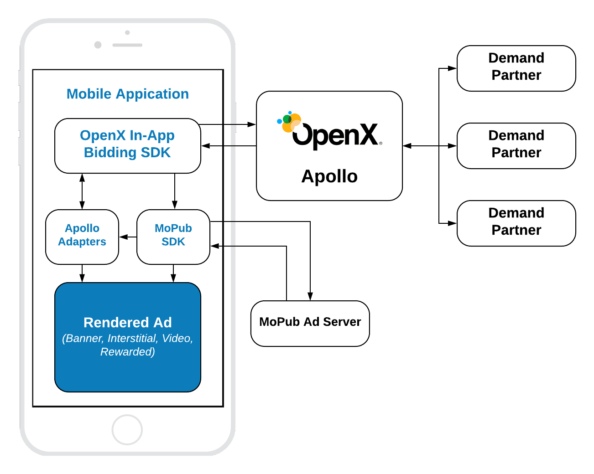

# MoPub Integration

## Table of Contents

1. [SDKs Integration](#mopub-sdk-integration)
2. [Order Setup](#order-setup)
3. [Mobile API](#mobile-api)
    - [Init SDK](#init-the-in-app-bidding-sdk)
    - [Banner](#banner-api)
    - [Interstitial](#interstitial-api)
    - [Rewarded](#rewarded-api)


## MoPub SDK Integration

The prerequisite of the In-App Bidding integration with MoPub is an installed MoPub SDK. If you do not have the MoPub SDK in the app yet, refer to the [MoPub's Documentation](https://github.com/mopub/mopub-android-sdk) for the integration process. The In-App Bidding SDK was tested with MoPub SDK 5.13.0. If you have any troubles with this or other versions, please contact the [OpenX Support](https://docs.openx.com/resources/support/).


## Order Setup

To integrate header bidding into MoPub you have to prepare a specific Order following the [instructions](android-in-app-bidding-mopub-order-setup.md) for particular ad type.

## Mobile API

The integration of header bidding into MoPub monetization is based on MoPub's Mediation feature.




The OpenX In-App Bidding SDK provides the ability to integrate header bidding for the following ad types:

- Display Banner
- Display Interstitial
- Video Interstitial
- Rewarded Video

However, the In-App Bidding facade for MoPub provides only three types of API classes for these ads:

- **Banner API** - for **Display Banner**
- **Interstitial API** - for **Display** and **Video** Interstitials
- **Rewarded API** - for **Rewarded Video**

For how to create an Apollo account and start using the Apollo SDK, see the [Getting Started](../android-in-app-bidding-getting-started.md) page first.

### Init the In-App Bidding SDK

To start running bid requests you have to provide an Account Id for your organization in the Apollo server to the SDK:

```
OXSettings.setBidServerAccountId(YOUR_ACCOUNT_ID)
```

The best way to achieve this is by utilizing the `onCreate()` method of your Application class.

The account ID is an identifier of the **Stored Request** of your organization on the Apollo UI.

### Add In-App Bidding Adapters

Adapters for the In-App bidding SDK are open source classes that serve like proxies between the MoPub SDK and any other one. For more details about Mediation and Adapters read the [MoPub's Documentation](https://developers.mopub.com/networks/integrate/mopub-network-mediation-guidelines/).

To integrate adapters for the In-App Bidding SDK just add the following lines in your build.gradle files:

Root build.gradle
```
allprojects {
    repositories {
      ...
      maven { url "http://sdk.prod.gcp.openx.org/" }
      ...
    }
}
```

App module build.gradle:
```
implementation('com.openx:apollo-mopub-adapters:x.x.x')
```

Or you can [download](https://storage.cloud.google.com/ox-cdn-prod-mobile/sdks/apollo/release/android/sdk/1.0.0/OpenX_Apollo_Android_MoPub_Adapters_1.0.0.zip) it manually and add it as any other regular library.

### Banner API

To display an ad you need to implement these easy steps:


``` kotlin
private fun initBanner() {
    // 1. Create and initialize MoPubView instance
    bannerView = MoPubView(requireContext())
    bannerView?.setAdUnitId(moPubAdUnit)
    bannerView?.bannerAdListener = this

    // Add moPubView to your viewContainer
    viewContainer?.addView(bannerView)

    val builder = SdkConfiguration.Builder(moPubAdUnit)
    MoPub.initializeSdk(requireContext(), builder.build()) {
        fetchAdUnit(configId, AdSize(320, 50))
    }
}

private fun fetchAdUnit(configId: String, size: AdSize) {
    if (bannerAdUnit == null) {
        // 2. initialize MoPubBannerAdUnit
        bannerAdUnit = MoPubBannerAdUnit(requireContext(), configId, size)
    }
    // 3. Run an Header Bidding auction on Apollo and provide MoPubView as parameter. It is important to execute this method after MoPub SDK initialization.
    bannerAdUnit?.fetchDemand(bannerView!!) {
        // 4. execute MoPubView `loadAd` when receiving a valid demand result
        bannerView?.loadAd()
    }
}
```

#### Step 1: Create Ad View

In the MoPub integration scenario the MoPub's SDK plays the central role in managing ad views in the application's UI. You have to create and place MoPub's Ad View into the app page. If a winning bid on Apollo wins in the MoPub waterfall, it will be rendered via Mediation in the place of the original MoPub's Ad View by the Apollo SDK.


#### Step 2: Create Ad Unit

Create the **`MoPubBannerAdUnit`** object with parameters:

- **`configId`** - an ID of Stored Impression on the Apollo server
- **`size`** - the size of the ad unit which will be used in the bid request.

#### Step 3: Fetch Demand

To run an auction on Apollo, run the `fetchDemand()` method which performs several actions:

- Makes a bid request to Apollo
- Sets up the targeting keywords to the MoPub's ad unit
- Passes the winning bid to the MoPub's ad unit
- Returns the result of bid request for future processing

#### Step 4: Load the Ad

When the bid request has completed, the responsibility of making the Ad Request is passed to the publisher. That is why you have to invoke `loadAd()` on the MoPub's Ad View explicitly in the completion handler of `fetchDemand()`.


#### Step 5: Rendering

If the Apollo bid wins on MoPub it will be rendered by `OpenXApolloBannerAdapter`. You do not have to do anything for this.  Just make sure that your order has been set up correctly and an adapter is added.

### Interstitial API

To display an ad you need to implement these easy steps:

``` kotlin
private fun initInterstitial() {
    // 1. Create and initialize MoPubInterstitial instance
    moPubInterstitial = MoPubInterstitial(requireActivity(), adUnit)
    moPubInterstitial?.interstitialAdListener = this

    // 2. Initialize MoPubInterstitialAdUnit
    moPubInterstitialAdUnit = MoPubInterstitialAdUnit(requireContext(), configId, minSizePercentage)

    val builder = SdkConfiguration.Builder(adUnit)
    MoPub.initializeSdk(requireContext(), builder.build()) {
        fetchInterstitial()
    }
}

private fun fetchInterstitial() {
    // 3. Execute `fetchDemand` method and provide MoPubInterstitial as parameter. It is important to execute this method after MoPub SDK initialization.
    moPubInterstitialAdUnit?.fetchDemand(moPubInterstitial!!) {
        // 4. Execute MoPubInterstitial `load` when receiving a valid demand result
        moPubInterstitial?.load()
    }
}


//...
// After ad is loaded you can execute `show` to trigger ad display
moPubInterstitial?.show()
```

The way of displaying **Video Interstitial Ad** is almost the same with two differences:

- Need to customize the ad unit kind
- No need to set up `minSizePercentage`

``` kotlin
private fun initInterstitial() {
    // 1. Create and initialize MoPubInterstitial instance
    moPubInterstitial = MoPubInterstitial(requireActivity(), adUnit)
    moPubInterstitial?.interstitialAdListener = this

    // 2. Initialize MoPubInterstitialAdUnit and provide VIDEO AdUnitFormat
    moPubInterstitialAdUnit = MoPubInterstitialAdUnit(requireContext(), configId, AdUnitFormat.VIDEO)

    val builder = SdkConfiguration.Builder(adUnit)
    MoPub.initializeSdk(requireContext(), builder.build()) {
        fetchInterstitial()
    }
}

private fun fetchInterstitial() {
    // 3. Execute `fetchDemand` method and provide MoPubInterstitial as parameter. It is important to execute this method after MoPub SDK initialization.
    moPubInterstitialAdUnit?.fetchDemand(moPubInterstitial!!) {
        // 4. Execute MoPubInterstitial `load` when receiving a valid demand result
        moPubInterstitial?.load()
    }
}

//...
// After ad is loaded you can execute `show` to trigger ad display
moPubInterstitial?.show()
```


#### Step 1: Create Ad View

In the MoPub integration scenario the MoPub SDK plays the central role in managing ad views in the application's UI. If a winning bid on Apollo wins in the MoPub waterfall, it will be rendered via Mediation by the Apollo SDK.


#### Step 2: Create Ad Unit

Create the **`MoPubInterstitialAdUnit`** object with the parameter:

- **`configId`** - an ID of Stored Impression on the Apollo server

#### Step 3: Fetch Demand

To run an auction on Apollo run the`fetchDemand()` method which performs several actions:

- Makes a bid request to Apollo
- Sets up the targeting keywords to the MoPub's ad unit
- Passes the winning bid to the MoPub's ad unit
- Returns the result of bid request for future processing

#### Step 4: Load the Ad

When the bid request has been completed the responsibility of making the Ad Request is passed on the publisher. That is why you have to invoke the `loadAd()` on the MoPub Ad View explicitly in the completion handler of the `fetchDemand()`.


#### Step 5: Rendering

If the Apollo bid wins on MoPub it will be rendered by `OpenXApolloInterstitialAdapter`. You do not have to do anything for this.  Just make sure that your order has been set up correctly and an adapter is added.


However, due to the expiration, the ad could become invalid with time. So it is always useful to check it with `interstitial?.isReady` before display.


### Rewarded API

To display an ad you need to implement the following easy steps:


``` kotlin
private fun initRewarded() {
    // 1. Create MoPubRewardedVideoAdUnit instance
    rewardedAdUnit = MoPubRewardedVideoAdUnit(requireContext(), adUnitId, configId)

    // 2. Initialize MoPub SDK and MoPubRewardedVideoManager.
    val builder = SdkConfiguration.Builder(adUnitId)
    MoPubRewardedVideoManager.init(requireActivity())
    MoPubRewardedVideoManager.updateActivity(requireActivity())
    MoPubRewardedVideos.setRewardedVideoListener(this)
    MoPub.initializeSdk(requireContext(), builder.build()) {
        fetchRewarded(adUnitId)
    }
}

private fun fetchRewarded(adUnitId: String) {
    // 3. Execute `fetchDemand` method and keywords Map as parameter. It is important to execute this method after MoPub SDK initialization.
    rewardedAdUnit?.fetchDemand(keywordsMap) {
        val keywordsString = convertMapToMoPubKeywords(keywordsMap)
        val params = MoPubRewardedVideoManager.RequestParameters(keywordsString)

        // 4. After creating RequestParameters from keywordsMap you can execute rewardedVideo loading
        MoPubRewardedVideos.loadRewardedVideo(adUnitId, params, null)
    }
}

//...
// After ad is loaded you can execute `show` to trigger ad display
MoPubRewardedVideos.showRewardedVideo(adUnitId)
```

#### Step 1: Create a Rewarded Ad Unit

Create the **`MoPubRewardedVideoAdUnit`** object with the parameter:

- **`configId`** - an ID of Stored Impression on the Apollo server

#### Step 2: Fetch Demand

To run an auction on Apollo, run the `fetchDemand()` method which does several things:

- Makes a bid request to Apollo
- Sets up the targeting keywords
- Returns the result of bid request for future processing

#### Step 3: Load the Ad

When the bid request has completed, the responsibility of making the Ad Request is passed to the publisher. That is why you have to invoke the `loadAd()` of the MoPub's Ad View explicitly in the completion handler of the `fetchDemand()`.


#### Step 5: Rendering

If the Apollo bid wins on MoPub it will be rendered by `OpenXApolloRewardedVideoAdapter`. You do not have to do anything for this.  Just make sure that your order has been set up correctly and an adapter is added.
