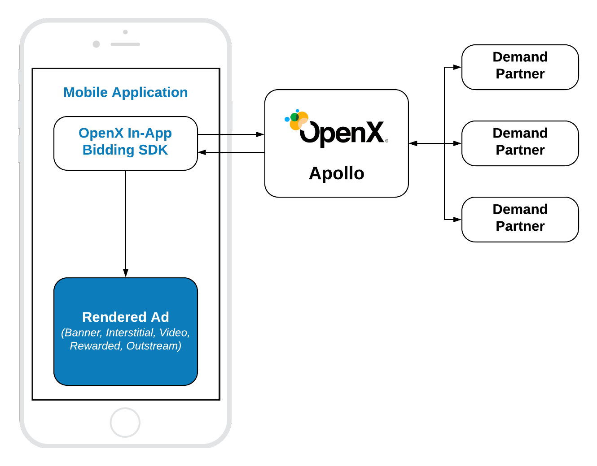

# Pure In-App Bidding Integration

## Table of Contents

- [Mobile API](#mobile-api)
- [Banner](#banner-api)
- [Interstitial](#interstitial-api)
- [Rewarded](#rewarded-api)

## Mobile API

The integration of Pure In-App Bidding is similar to the [integration](../android-sdk-integration.md) of any other regular Ad SDK. The only difference is that the header bidding auction will be run at the backend instead of the Ad Server auction.




The OpenX In-App Bidding SDK provides ability to integrate header bidding for the following ad types:

- Display Banner
- Display Interstitial
- Video Interstitial
- Rewarded Video
- Outstream Video

However, the OpenX In-App Bidding facade provides only three kinds of API classes for these ads:

- **Banner API** - for **Display Banner**
- **Interstitial API** - for **Display** and **Video** Interstitials
- **Rewarded API** - for **Rewarded Video**

For how to create an Apollo account and start using the Apollo SDK, see the [Getting Started](../android-in-app-bidding-getting-started.md) page first.

### Banner API

To display an ad you need to implement the following easy steps:


``` kotlin
// 1. Create an Ad View
bannerView = BannerView(requireContext(), configId, adSize)
bannerView?.setBannerListener(this)

// Add view to viewContainer
viewContainer?.addView(bannerView)

// 2. Load ad
bannerView?.loadAd()
```

#### Step 1: Create Ad View

In the Pure In-App Bidding scenario you just need to initialize the Banner Ad View with correct properties:

- **`configId`** - an ID of Stored Impression on the Apollo server.
- **`size`** - the size of the ad unit which will be used in the bid request.

And assign the [listener](../android-in-app-bidding-listeners.md) for processing ad events.

#### Step 2: Load the Ad

Simply call `loadAd()` and the SDK will:

- make a bid request to Apollo
- render the winning bid on display

#### Outstream Video

For **Outstream Video** you also need to specify the video placement type of the expected ad:

``` kotlin
bannerView.videoPlacementType = PlacementType.IN_BANNER // or any other available type
```

### Interstitial API

To display an ad you need to implement the following easy steps:


``` kotlin
// 1. Create an Interstitial Ad Unit
interstitialAdUnit = InterstitialAdUnit(requireContext(), configId, minSizePercentage)
interstitialAdUnit?.setInterstitialAdUnitListener(this)

// 2. Load Ad
interstitialAdUnit?.loadAd()
// .....

// 3. Show the ad
interstitialAdUnit?.show()
```

The way of displaying **Video Interstitial Ad** is almost the same with two differences:

- Need customize the ad unit format.
- No need to set up `minSizePercentage`.

``` kotlin
// 1. Create an Interstitial Ad Unit
interstitialAdUnit = InterstitialAdUnit(requireContext(), configId, AdUnitFormat.VIDEO)
interstitialAdUnit?.setInterstitialAdUnitListener(this)

// 2. Load Ad
interstitialAdUnit?.loadAd()

// .....

// 3. Show the ad
interstitialAdUnit?.show()
```


#### Step 1: Create an Ad Unit


In the Pure In-App Bidding scenario you just need to initialize the Banner Ad View with correct properties:

- **`configId`** - an ID of Stored Impression on the Apollo server
- **`minSizePercentage`** - specifies the minimum width and height percent an ad may occupy of a device’s real estate.

Also you can assign the [listener](../android-in-app-bidding-listeners.md) for processing ad events.

> **NOTE:** `minSizePercentage` plays an important role in a bidding process for display ads. If the provided space is not enough, demand partners will not respond with the bids.

#### Step 2: Load the Ad

Simply call the `loadAd()` method to start the [In-App Bidding](../android-in-app-bidding-getting-started.md) flow.


#### Step 3: Show the Ad when Ready


The most convenient way to determine if the ad is ready for displaying is to subscribe to the particular [litener](../android-in-app-bidding-listeners.md) method:

``` kotlin
override fun onAdLoaded(interstitialAdUnit: InterstitialAdUnit) {
//Ad is ready for display
}
```

### Rewarded API

To display an ad you need to implement the following easy steps:


``` kotlin
// 1. Create an Ad Unit
rewardedAdUnit = RewardedAdUnit(requireContext(), configId)
rewardedAdUnit?.setRewardedAdUnitListener(this)

// 2. Execute ad load
rewardedAdUnit?.loadAd()

/// .......

// After ad is loaded you can execute `show` to trigger ad display
rewardedAdUnit?.show()
```

To be notified when a user earns a reward, implement the `RewardedAdUnitListener` interface. Now this method will be called when the ad is completed.

``` kotlin
fun onUserEarnedReward(rewardedAdUnit: RewardedAdUnit)
```


#### Step 1: Create Rewarded Ad Unit

Create the **`RewardedAdUnit`** object with the parameter:

- **`adUnitId`** - an ID of Stored Impression on the Apollo server.

#### Step 2: Load the Ad

Simply call the `loadAd()` method to start the [In-App Bidding](../android-in-app-bidding-getting-started.md) flow.


#### Step 3: Show the Ad when Ready


The most convenient way to determine if the ad is ready for displaying is to subscribe to the particular [listener](../android-in-app-bidding-listeners.md) method:

``` kotlin
override fun onAdLoaded(rewardedAdUnit: RewardedAdUnit) {
//Ad is ready for display
}
```
