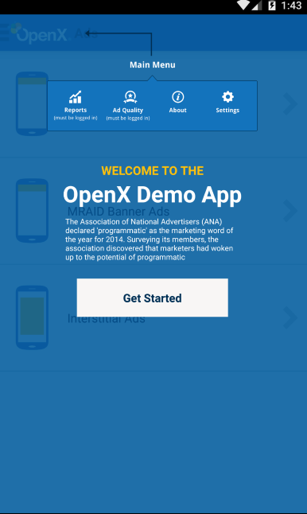
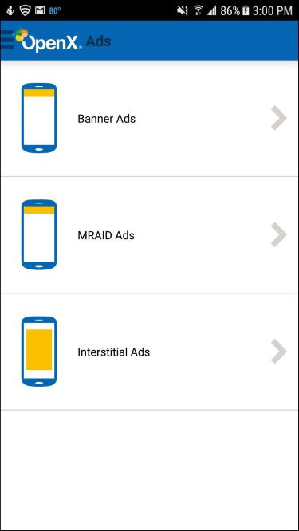
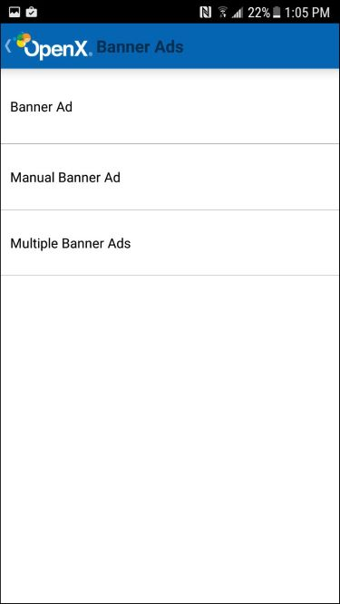
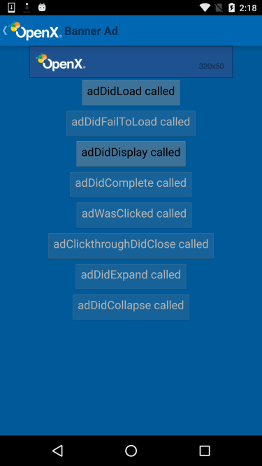

Launching the demo app
==============================

The OpenX Mobile Android SDK demo app provides the following:

-   An implementation guide for various types of ad units.
-   A way to test mobile ad units on supported Android devices.

To launch the OpenX Android demo app from your integrated development
environment (IDE):

1.  Download the zip file, expand it, and open the demo app directory.

    Upon running the project, the **Get Started** screen is displayed:
    
    
    
2.  Tap **Get Started**.

    A set of ad types is displayed:

    -   **Banner Ads**. Various types of banner ads.
    -   **MRAID Ads**. Rich media banner and interstitial ads.
    -   **Interstitial Ads**. Full-screen interstitial ads.
    
    
    
3.  Tap an ad type.

    For example, if you click **Banner Ads**, the following screen is
    displayed:
    
    
4.  When you tap an ad type, a sample ad of that type is displayed.

    
